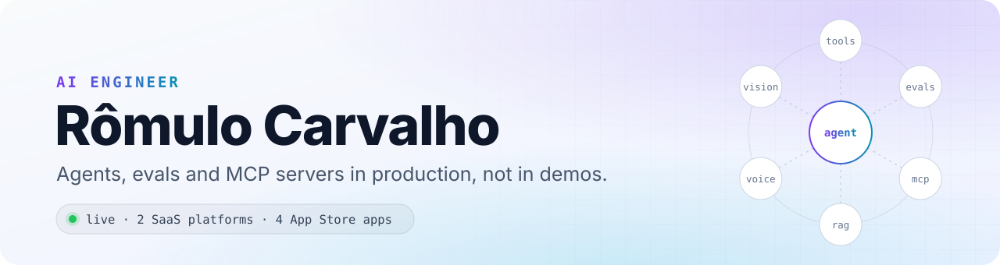
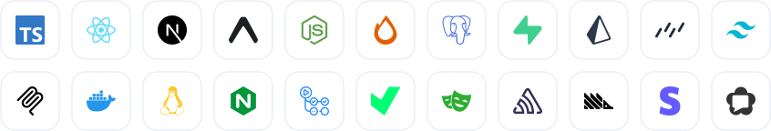

<picture>
  <source media="(prefers-color-scheme: dark)" srcset="assets/hero-dark.svg">
  
</picture>

I'm an **AI Engineer** who builds and runs complete products on my own, from the database and the agents to the app on the App Store. Everything below is live.

### AI in production

- **Evals drive model decisions.** Golden sets, rubric-based LLM-as-a-judge scoring and cost/latency baselines. Swapping a model is a measured call, not a guess.
- **Tool-using agents.** A WhatsApp assistant that checks availability, books and reschedules appointments, and a support agent with long-term memory and hybrid retrieval (vector + full-text, re-ranked).
- **Remote MCP servers with OAuth 2.1.** Two in production, listed in the official MCP Registry.
- **Grounded answers.** Every claim cites the exact page of the source document it came from.
- **Cost and reliability.** Multi-provider routing with automatic fallback. Silence trimming in the speech-to-text pipeline cut real transcription cost by 22%.
- **Guardrails.** A deterministic output filter behind the prompt rules, so policy holds even when the model doesn't.
- **Voice and vision.** Transcription, text-to-speech and photo/document understanding inside mobile apps.

### Live products

| Product | What it is | Built with |
| --- | --- | --- |
| [**Sinthoma**](https://sinthoma.com.br) | Clinical records platform with video sessions, WhatsApp automation and an MCP server | Next.js 16 · React 19 · PostgreSQL (RLS) · WebRTC |
| [**JusPronto**](https://juspronto.com.br) | Practice management for law firms, with document analysis and a WhatsApp front desk | Express 5 · Next.js 16 · Prisma · PostgreSQL |
| [**Vó Zefa**](https://apps.apple.com/br/app/v%C3%B3-zefa-simpatias-e-ora%C3%A7%C3%B5es/id6768735652) | Conversational app with voice, on the [App Store](https://apps.apple.com/br/app/v%C3%B3-zefa-simpatias-e-ora%C3%A7%C3%B5es/id6768735652) and [Google Play](https://play.google.com/store/apps/details?id=com.vozefa.app) | Expo · Hono · in-app subscriptions |
| [**Mochilu**](https://apps.apple.com/br/app/mochilu-guarda-compartilhada/id6817340990) | Turns school notices into a shared family calendar | React Native · Expo |
| [**LetterSprig**](https://apps.apple.com/br/app/lettersprig-escreva-bonito/id6817156895) | Handwriting practice app | React Native · Expo |
| [**Runu**](https://apps.apple.com/br/app/runu/id6766942426) | Running coach for beginners | React Native · Expo |
| Cravar · Clarochet · Candeia | Three more iOS apps, in App Store review | React Native · Expo |

### Stack

<picture>
  <source media="(prefers-color-scheme: dark)" srcset="assets/tech-dark.svg">
  
</picture>

**TypeScript-first, end to end.** Web, mobile, backend and infrastructure in one language.

### How I work

- **Ship, measure, iterate.** Error tracking and product analytics on everything I run.
- **Secure by default.** Row-level security on every table, LGPD-compliant data handling, secrets never in code.
- **Tests where it hurts.** 400+ test files in the main product, end-to-end journeys in a real browser, evals for anything with a model in it.

### Open source

- [**remote-mcp-server-template**](https://github.com/romulorgc/remote-mcp-server-template). Production-ready remote MCP server in TypeScript: Streamable HTTP, OAuth 2.1 resource server, per-tool scopes with step-up, 67 tests.

The product code is private. I extract the reusable parts into open source.

### Contact

🇧🇷 Em português

 

Sou **AI Engineer**. Construo e mantenho sozinho produtos inteiros com IA no centro: agentes com ferramentas, avaliações (evals), servidores MCP com OAuth 2.1, voz e visão, do banco de dados ao app na App Store. Tudo acima está no ar. Fale comigo no X: [@romulocarvs](https://x.com/romulocarvs).

